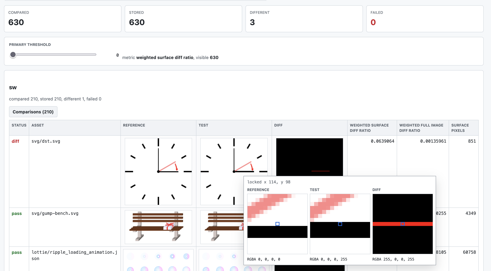

[](LICENSE)
[](https://github.com/thorvg/thorvg)

# ThorVG Pixel Inspector

<p align="center">
  
</p>

**Pixel Inspector** is a rendering inspection tool for ThorVG. It renders
SVG and Lottie assets and compares generated PNGs against references with
NVIDIA FLIP or a weighted RGBA pixel diff evaluator.

## Features

<p align="center">
  
</p>

- Renders SVG and Lottie assets with ThorVG backends.
- Compares rendered PNGs against references with NVIDIA FLIP or weighted RGBA pixel diff.
- Provides HTML or Markdown reports.

## Requirements

- C++17 compiler
- Meson and Ninja
- ThorVG installed with the required engines, loaders, and Lottie support
- SDL2 for the macOS and Windows OpenGL test context
- `wgpu-native` when testing the WebGPU backend

ThorVG can be installed from source with the helper script:

```sh
./install_thorvg.sh main
./install_thorvg.sh v1.0.5
```

## Build

```sh
meson setup builddir
meson compile -C builddir
```

By default, resources are read from `res` and generated files are written under `artifacts`.

## Usage

```sh
./builddir/src/tvg-pixel-inspector --backend=sw
./builddir/src/tvg-pixel-inspector --backend="gl,wg,sw"
./builddir/src/tvg-pixel-inspector --evaluator=pixel --backend=sw
./builddir/src/tvg-pixel-inspector --update-reference --backend="gl,wg,sw"
```

Helper scripts are also available:

```sh
./install_thorvg.sh v1.0.5
./build_and_run.sh --update-reference

./install_thorvg.sh main
./build_and_run.sh
```

`build_and_run.sh` configures and builds the inspector in `build/`, then forwards
all arguments to the executable.

```sh
./update_and_run.sh v1.0.5 main
```

`update_and_run.sh` takes two ThorVG refs. The first ref is used to install
ThorVG and update the reference images. The second ref is then installed and
compared against those references.

### Options

| Option | Description |
| --- | --- |
| `--backend=<list>` | Render backend list. |
| `--resource=<dir>` | Resource directory. |
| `--reference=<dir>` | Reference directory. |
| `--test=<dir>` | Test output directory. |
| `--report=<dir>` | Report output directory. |
| `--report-format=<html\|md>` | Report format. |
| `--evaluator=<flip\|pixel>` | Image comparison strategy. |
| `--max-width=<px>` | PNG fit cell width. Images are scaled to fit this box while preserving aspect ratio. |
| `--flip-surface-mean-threshold=<value>` | Alpha-surface FLIP mean threshold. |
| `--flip-surface-error-floor-threshold=<value>` | Error contribution ignored per alpha-surface FLIP threshold. |
| `--pixel-channel-threshold=<value>` | RGBA Chebyshev distance threshold for the pixel evaluator. |
| `--pixel-surface-diff-ratio-threshold=<value>` | Weighted surface diff ratio threshold for the pixel evaluator. |
| `--pixel-background-ratio=<value>` | Repeated visible color ratio used for common background detection. |
| `--update-reference` | Update references. |
| `--help` | Print command line help. |

### Evaluator

When `--evaluator=pixel` is selected:

- Pixels are compared by RGBA Chebyshev distance, which uses the largest channel
  delta among R, G, B, and A.
- Transparent pixels and detected common background pixels are excluded from the
  comparison surface.
- An image is marked as different when its weighted surface diff ratio reaches
  `--pixel-surface-diff-ratio-threshold`.

When `--evaluator=flip` is selected:

- Images are compared with NVIDIA FLIP error metrics.
- Fully transparent pixels are excluded from the visible surface measurement.
- An image is marked as different when the adjusted surface mean reaches
  `--flip-surface-mean-threshold`.

### Draw Tests

C++ draw tests can be registered with `DRAW_TEST` under `src/draw_test`:

```cpp
DRAW_TEST(name, width, height, canvas)
{
    // Add ThorVG paints to canvas.
    return true;
}
```

For each backend, registered draw tests are rendered after that backend's asset
tests. In update mode, their reference images are updated after that backend's
asset references.

Add new draw test `.cpp` files to `src/draw_test/meson.build` so they are linked
into the inspector and registered at startup.

Current draw tests cover shapes, paths, gradients, gradient strokes, fill rules,
fill spread modes, scenes, opacity, trim paths, text layout, raw picture tiling,
SVG pictures, and clipping.

## Output Layout

```text
artifacts/
  reference/
    <backend>/
      draw_test/
      lottie/
      svg/
  test/
    <backend>/
      draw_test/
      lottie/
      svg/
  report/
    reporter.html or reporter.md
    data.json
    diff/
      <backend>/
        draw_test/
        lottie/
        svg/
```

The report file is `reporter.html` for HTML output and `reporter.md` for Markdown output.
Test and reference paths use each asset path relative to the resource directory:

```text
res/target/lottie/sample.json
  -> artifacts/test/sw/lottie/sample.png
  -> artifacts/reference/sw/lottie/sample.png
```

## Resources

Default assets are stored in `res/target`:

- `res/target/svg`: SVG resources
- `res/target/lottie`: Lottie JSON resources

Use `--resource <dir>` to run another target resource directory.

## License

Pixel Inspector is distributed under the MIT license. See [LICENSE](LICENSE).

This project includes NVIDIA FLIP as `src/external/nv_flip.h`. The vendored header
retains its BSD-3-Clause license notice and is used without CUDA support.

PNG encoding and decoding use lodepng. lodepng is distributed under the zlib
license, and its license notice is retained in `src/external/lodepng.h` and
`src/external/lodepng.cpp`.
