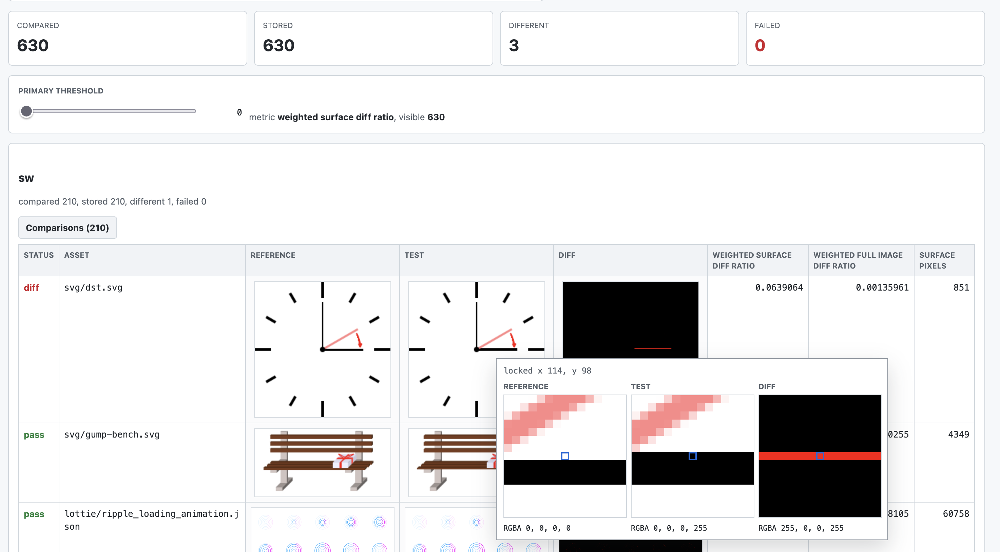

[](LICENSE)
[](https://discord.gg/n25xj6J6HM)
[](https://opencollective.com/thorvg)

# ThorVG Pixel Inspector

<p align="center">
  
</p>

**Pixel Inspector** is a rendering inspection tool for ThorVG. It renders
SVG and Lottie assets and compares generated PNGs against golden images with a
weighted RGBA pixel diff evaluator.

## Features

<p align="center">
  
</p>

- Renders SVG and Lottie assets with ThorVG backends.
- Compares rendered PNGs against golden images with weighted RGBA pixel diff.
- Provides HTML reports and a compact markdown summary for CI.

## Requirements

- C++17 compiler
- Meson and Ninja
- ThorVG installed with the required engines, loaders, and Lottie support
- SDL2 for the macOS and Windows OpenGL test context
- `wgpu-native` when testing the WebGPU backend

ThorVG can be installed from source with the helper script:

```sh
./install_thorvg.sh main
./install_thorvg.sh v1.0.5
```

## Build

```sh
meson setup builddir
meson compile -C builddir
```

By default, target resources are read from `res/target` and generated files are
written under `output`.

## Usage

```sh
./builddir/src/tvg-pixel-inspector --backend=sw
./builddir/src/tvg-pixel-inspector --backend="gl,wg,sw"
./builddir/src/tvg-pixel-inspector --update-golden --backend="gl,wg,sw"
```

Helper scripts are also available:

```sh
./install_thorvg.sh v1.0.5
./build_and_run.sh --update-golden

./install_thorvg.sh main
./build_and_run.sh
```

`build_and_run.sh` configures and builds the inspector in `build/`, then forwards
all arguments to the executable.

```sh
./update_and_evaluate.sh v1.0.5 main
```

`update_and_evaluate.sh` takes two ThorVG refs. The first ref is used to install
ThorVG and update the golden images. The second ref is then installed and
compared against those golden images.

### Options

| Option | Description |
| --- | --- |
| `--backend=<list>` | Render backend list. |
| `--resource=<dir>` | Resource directory. |
| `--output=<dir>` | Output directory. |
| `--max-width=<px>` | PNG fit cell width. Images are scaled to fit this box while preserving aspect ratio. |
| `--max-channel-distance-threshold=<value>` | Max-channel distance threshold. A pixel counts as different when its RGBA Chebyshev distance exceeds this. Default `0`. |
| `--diff-ratio-threshold=<value>` | Diff ratio threshold. An image is marked different when its diff ratio exceeds this. Default `0`. |
| `--update-golden` | Update golden images. |
| `--help` | Print command line help. |

### Evaluator

- Pixels are compared by RGBA Chebyshev distance, which uses the largest channel
  delta among R, G, B, and A.
- Fully transparent pixels (alpha 0 in both the golden and the actual) are
  excluded; every other pixel is compared.
- A pixel counts as different when its distance exceeds
  `--max-channel-distance-threshold` (default `0`, so any non-identical pixel
  counts).
- An image is marked as different when its diff ratio exceeds
  `--diff-ratio-threshold` (default `0`, so a single differing pixel fails the
  image). These defaults make comparisons strict.
- The report also lists `Diff Pixel Count`, the number of differing pixels in
  each comparison.

### Draw Tests

C++ draw tests can be registered with `DRAW_TEST` under `src/draw_test`:

```cpp
DRAW_TEST(name, width, height, canvas)
{
    // Add ThorVG paints to canvas.
    return true;
}
```

For each backend, registered draw tests are rendered after that backend's asset
tests. In update mode, their golden images are updated after that backend's
asset golden images are updated.

Add new draw test `.cpp` files to `src/draw_test/meson.build` so they are linked
into the inspector and registered at startup.

Current draw tests cover shapes, paths, gradients, gradient strokes, fill rules,
fill spread modes, scenes, opacity, trim paths, text layout, raw picture tiling,
SVG pictures, and clipping.

### Visual walkthrough

The workspace includes a three-episode tmath series that explains the run
pipeline, the pixel evaluator, and the draw-test registration path. With the
tmath VS Code extension installed, open this repository and run
**tmath: Open Viewer**, then select the `pixel-inspector` series.

To exercise the same flow from the command line:

```sh
meson setup builddir
meson compile -C builddir

# Create or refresh the baseline images.
./builddir/src/tvg-pixel-inspector --update-golden --backend=sw

# Render actual images, compare them, and write the reports.
./builddir/src/tvg-pixel-inspector --backend=sw
```

Open `output/reporter.html` for the full comparison and `output/reporter.md`
for the compact summary. A comparison run exits with status `1` when a backend
has differences or errors.

## Output

```text
output/
  reporter.html
  reporter.md
  draw_test/
    viewport.gl.golden.png
    viewport.gl.actual.png
    viewport.gl.diff.png
    viewport.wg.golden.png
    viewport.wg.actual.png
    viewport.wg.diff.png
    viewport.sw.golden.png
    viewport.sw.actual.png
    viewport.sw.diff.png
    ...
  lottie/
    sample.gl.golden.png
    sample.gl.actual.png
    sample.gl.diff.png
    sample.sw.golden.png
    ...
  svg/
    logo.gl.golden.png
    logo.gl.actual.png
    logo.gl.diff.png
    logo.gl.sw.png
    ...
```

The report files are written directly under the output directory:
`reporter.html` is the full interactive report, and `reporter.md` is a compact
markdown summary (per-backend `Compared`, `Differences`, `Errors` counts) that
CI can publish as-is.
Generated image paths use each asset path relative to the resource directory:

```text
res/target/lottie/sample.json
  -> output/lottie/sample.sw.golden.png
  -> output/lottie/sample.sw.actual.png
  -> output/lottie/sample.sw.diff.png
```

## Resources

Default assets are stored in `res/target`:

- `res/target/svg`: SVG resources
- `res/target/lottie`: Lottie JSON resources

Use `--resource <dir>` to run another target resource directory.

## License

Pixel Inspector is distributed under the MIT license. See [LICENSE](LICENSE).

PNG encoding and decoding use lodepng. lodepng is distributed under the zlib
license, and its license notice is retained in `src/saver/lodepng.h` and
`src/saver/lodepng.cpp`.
